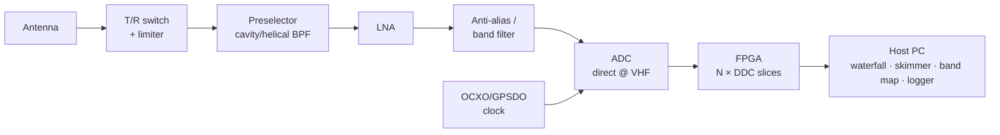
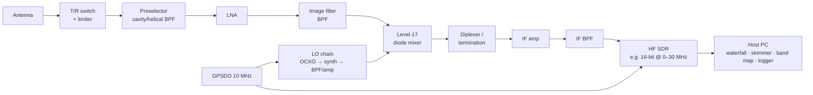
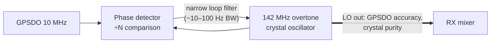

# 02 — Architecture options (trade study, RX side)

The first fork in the design: where does the signal get digitized?
Everything else — parts list, level plan, LO strategy, digitizer choice —
follows from this.

Both options share the same antenna-side front end (preselector, LNA, T/R
switching, sequencer) and the same software layer. They differ in what sits
between the LNA and the DSP.

## Option A — Direct sampling

Digitize the whole band (or a large chunk of it) directly at VHF.

**For:**
- Minimal analog chain — fewer blocks to source, measure, and shield.
- N simultaneous receivers fall out of the FPGA for free; the multi-VFO
  goal is trivially met.
- No mixer spurs, no image problem, no IF planning.
- "LO purity" becomes clock jitter — and a surplus OCXO/GPSDO clock chain
  can be excellent.

**Against:**
- The ADC platform choice dominates performance; the surplus-brick arbitrage
  barely applies to this option — most of the budget lands on the digitizer.
- Blocking/overload handled almost entirely by ADC dynamic range plus the
  preselector; less opportunity to distribute gain and filtering through a
  chain.
- High-performance direct-sampling platforms at VHF (16-bit ADC class,
  RFSoC) are the one part of the market where surplus is *not* cheap.

## Option B — Brick superhet down to an HF-class SDR (transverter topology)

Convert 144 MHz (etc.) to a low IF with surplus mixers and a lab-grade LO,
then digitize with a cheap, proven HF SDR.

**For:**
- Plays directly to the surplus thesis: mixers, LO blocks, IF amps, filters
  are exactly what the used market sells cheap.
- Gain, filtering, and dynamic range distributed across a chain the designer
  controls — classic contest-grade RX engineering is possible.
- The digitizer becomes a commodity HF SDR (well-understood, cheap,
  replaceable).
- Multiband later = one more converter front end per band into the same IF.

**Against:**
- Much more analog chain: image filtering, IF planning, diplexers, mixer
  termination, LO leakage management — every classic superhet problem is
  back on the table.
- Multi-RX is limited to the IF bandwidth the converter passes (typically
  fine: a whole 2 MHz band segment fits, but it must be designed for).
- The LO chain must be genuinely good, or the whole phase-noise argument
  collapses. (Mitigation: this is exactly the block the surplus market is
  best at.)

## Option C (hybrid, noted for completeness)

A wideband direct-sampling *spotting* receiver (Option A, built cheap —
even an RX-only SDR) alongside a brick superhet *primary* receiver
(Option B). The spotter only needs to find signals; the primary only needs
to work them. Decouples the performance requirements of the two jobs.

## Status

Open — see [decisions.md](decisions.md), but converging on **B**. Two
forces now point the same way:

1. The parts thesis (surplus mixers/LO/IF bricks are where the arbitrage
   lives) — the original argument.
2. A digitizer preference set in the RX requirements: **high resolution,
   low bandwidth**. The band is 2 MHz wide and never wider (#7, #15), so
   sample rate above a few Msps buys nothing — while every extra ADC bit
   buys blocking dynamic range in a strong-neighbor contest environment.
   A 16-bit-class ADC at low rate is exactly the commodity HF-SDR
   digitizer of Option B; wideband direct-sampling (Option A) spends its
   money on bandwidth we'd throw away. High-res low-BW converters can't
   digitize 144 MHz directly — the conversion stage isn't a compromise,
   it's what lets the best-fit ADC be used at all.

### How many bits are actually useful? (~16 — beyond that, diminishing returns)

Marketing bits ≠ delivered bits: a good "16-bit" Msps-class ADC delivers
~12.5–13.5 ENOB (~78–84 dB SNR at full scale). That sounds short of
contest-grade until **processing gain** is counted: the noise is spread
across the whole digitized span, and filtering 2.5 Msps down to a 500 Hz
CW slice recovers 10·log₁₀(2.5 M/500) ≈ **37 dB**. So a real 16-bit
converter yields ~**115 dB dynamic range in 500 Hz** — the same territory
as the best analog contest receivers ever built.

Why more bits stop paying:

- Above that level, **other limits dominate**: clock jitter (reciprocal
  mixing's digital twin), front-end IMD in the LNA/mixer, and the band's
  own noise floor arriving through the antenna. A 20-ENOB converter behind
  a chain that delivers 110 dB is buying resolution for signals the chain
  has already corrupted.
- True >16-ENOB converters at Msps rates essentially don't exist —
  "24-bit" parts at these speeds deliver nowhere near 24 (delta-sigma
  parts hit high ENOB only at audio-class rates).
- The last practical win of the 16-bit class is operational: enough
  headroom to run **fixed RF gain with no AGC ahead of the ADC** — the
  strongest neighbor just uses the top bits while the noise floor stays
  put. That property arrives at ~16 bits; more bits don't add a second
  such threshold.

Spec consequence: digitizer target is a **true 16-bit-class ADC (≥ ~12.5
ENOB at the IF), clocked from the GPSDO-disciplined reference with a
jitter budget matched to those bits** — clock quality is spent as
carefully as bit count, or the bits are fiction.

### LO implementation: crystal at the LO frequency, disciplined by PLL *(leaning)*

Refinement of decision #9. Two ways to make a fixed, GPSDO-traceable
~142 MHz LO (144–146 → 2–4 MHz IF):

1. **Multiply 10 MHz up** — inherits the reference's phase noise
   **+ 20·log₁₀(14.2) ≈ +23 dB** everywhere. Simple, but pays the
   multiplication tax at every offset.
2. **Run an actual VHF crystal oscillator at 142 MHz** (overtone crystal),
   **phase-locked to the 10 MHz GPSDO through a deliberately narrow
   loop**. Inside the loop bandwidth the PLL steers the crystal — accuracy
   and long-term drift become the GPSDO's. Outside the loop bandwidth the
   PLL is blind and the output is the **crystal's own phase noise at
   carrier frequency — no multiplication tax at all**.

The design subtlety that decides whether this wins: **inside** the loop
bandwidth the output still carries the reference's multiplied noise
(+23 dB); **outside** it carries the crystal's. So the loop bandwidth must
sit at the crossover where the multiplied-reference curve meets the
crystal's own curve — typically tens of Hz. Set it too wide and the loop
injects the multiplication tax back in; too narrow and the crystal wanders
thermally before the loop catches it. This crossover measurement is a
bench task once parts are in hand.

Practical notes:

- 142 MHz means a 5th/7th-overtone crystal — custom-ordered (quartz houses
  still cut these; also the standard transverter-LO crystal ecosystem,
  e.g. 116 MHz, shows the supply chain exists) or harvested.
- **IF placement: 4–6 MHz (LO at 140 MHz), not 2–4 (LO at 142).** Two
  reasons to sit higher:
  - *DC/low-frequency hygiene* — more distance from ADC offset, drift,
    and the 1/f region of the IF amps; the band floor at 4 MHz is
    comfortably clear of all of it.
  - *The octave problem (the stronger reason)* — a 2–4 MHz IF spans an
    octave: the second harmonic of the band bottom (2×2 = 4 MHz) lands
    exactly at the band top, so any even-order distortion in the IF
    amps or ADC front end drops harmonics of strong in-band signals
    **onto other in-band frequencies**. At 4–6 MHz the second harmonic
    of the bottom edge (8 MHz) is already above the top edge — the
    passband is harmonic-free for 2nd order (and 3rd: 12 MHz). One MHz
    of placement buys a whole class of spurs gone.
  - Bonus: 140 MHz = 14 × 10 MHz exactly — integer-N comparison against
    the GPSDO makes the clean-up loop's divider trivial.
  - LO and image both remain safely out of band (image 134–136 MHz, to
    the preselector; LO 4 MHz below the band edge).
- **Decimation moves to software too.** With the IF at 4–6 MHz the ADC
  runs at a modest rate (e.g. 16 Msps real, band well under the 8 MHz
  Nyquist edge), and the raw sample stream is only 16 Msps × 16 bit ≈
  **256 Mbit/s — it fits the point-to-point GbE link as-is**. So the head
  doesn't even need DDC gateware: it ships raw IF samples, and the ground
  station does the entire digital down-conversion (mix 5 MHz → baseband,
  filter, decimate to the 2.5 Msps band stream) in software. The masthead
  FPGA's remaining digital job collapses to *packetizing ADC samples into
  Ethernet frames* plus the safety/keying logic — the dumbest, most
  verifiable gateware possible, and the GS gains yet another
  runtime-changeable stage (decimation filters as arrays in memory, per
  the no-FPGA-filters rule in 05). Recording can then even keep the raw
  IF stream (≈ 32 MB/s, ~5.5 TB/48 h) when wanted, with the 2.5 Msps
  archive as the default.
- **Microphonics are the new enemy**: VHF crystals are vibration-sensitive
  and this one lives *on a mast in the wind*. Mechanical mounting
  (mass, damping, orientation) is part of the LO design, and the narrow
  loop can't correct vibration-rate phase modulation — it's outside the
  loop BW by construction.
  **Mitigation plan, imported from drone practice** (same physics as
  soft-mounting an IMU away from motor vibration):
  - *TPU-printed isolation mount* for the oscillator sub-assembly, with
    added brass mass — a mass-on-damped-spring is a mechanical low-pass
    filter. Tune its resonance well **below** the mast's dominant
    excitation frequencies so wind/rotator vibration is attenuated, not
    amplified; TPU's high loss factor keeps the mount's own resonance
    tame. Print-tunable stiffness (infill/wall count) makes iterating
    the corner frequency a bench afternoon, not a machining job.
  - *Characterize before tuning*: put an IMU in the head enclosure (drone
    hardware again) and record the actual vibration spectrum on the real
    mast in real wind — mast resonances, rotator steps, guy-wire hum.
    Design the isolator against measured spectra, not guesses. The IMU
    stays installed afterward as a permanent health sensor.
  - *Escalation path if passive isn't enough*: vibration-induced phase
    error is deterministic given the crystal's g-sensitivity vector — the
    IMU stream can drive **feed-forward digital phase correction** in the
    GS DSP (the avionics OCXO trick; the "PID for the mast" instinct,
    applied where it works — in the signal path, not the mount).
- The same architecture serves the TX IQ LO (mid/edge-band per #22) with a
  second crystal.

Remaining before closing: the combined platform decision (#8 + #22 TX) —
the digitizer, the PureSignal feedback channel, and the IQ TX path should
land on one coherent platform. A costed trade study with real surplus
prices is the next step.

## TX side

Deliberately deferred until the RX architecture is fixed; both options
imply a matching upconversion/exciter strategy (B gives it almost for free
— the same mixer topology run in reverse; A implies a TX DAC on the
platform).
