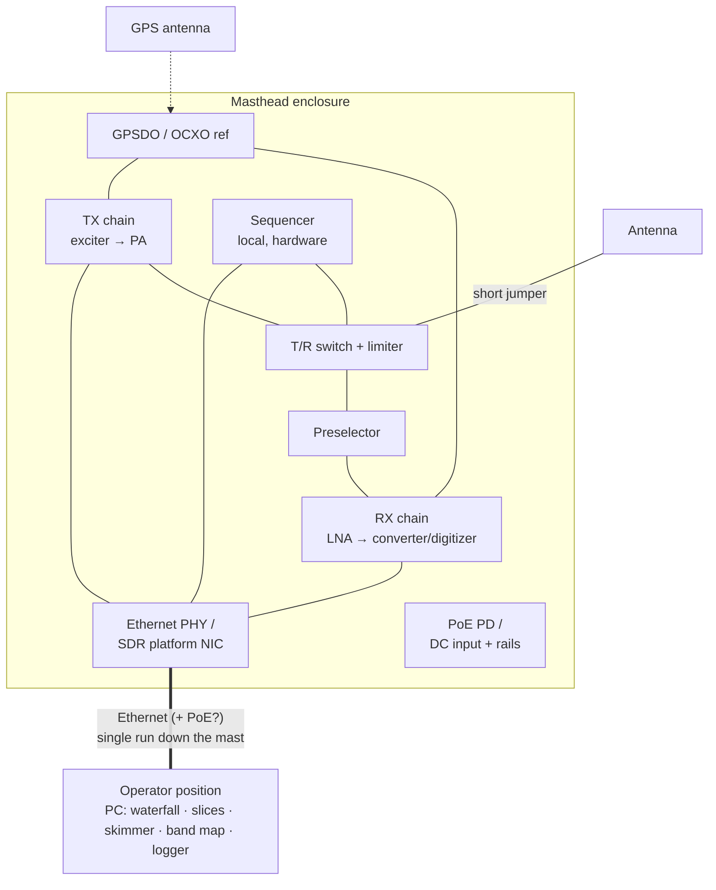

# 03 — Station topology: mast-mounted RF head

## Decision

The entire radio lives in a weatherproof enclosure on the mast, directly
below the antenna. The feedline shrinks from tens of meters of coax to a
jumper. The link down to the operator is **Ethernet**; power comes up the
same cable as **PoE if the power budget allows**, otherwise as a separate
DC pair alongside the Ethernet run.

This turns the design into a **remote RF head + software operator
position** — the same architecture as modern commercial base stations, and
the logical endpoint of the project thesis: once the radio is a network
device, the operator position is purely software and can be anywhere.

## What this wins

- **Noise figure set at the antenna, permanently.** No feedline loss ahead
  of the LNA, no masthead-preamp-vs-shack-rig gain juggling. The level plan
  starts at the antenna port.
- **TX loss eliminated too** — every dB of coax loss removed counts twice
  (RX NF and TX ERP).
- **One cable up the mast.** No rotator loops full of heliax, no separate
  preamp sequencing lines — control, IQ data, and (ideally) power share the
  run.
- **Digitizer choice narrows helpfully**: the platform must be
  Ethernet-native. Hermes-Lite 2, Red Pitaya, ANAN-class boards all speak
  Ethernet as their primary interface — this constraint costs nothing and
  eliminates USB-tethered candidates (decisions.md #8).
- **GPS antenna is right there** — the GPSDO reference gets sky view for
  free.

## What this costs (design obligations, not objections)

1. **The power budget decides PoE feasibility — power is now a gating
   question.** PoE classes at the powered device, roughly:

   | Standard | Power at PD | Supports |
   | --- | --- | --- |
   | 802.3af | ~13 W | RX + control only |
   | 802.3at (PoE+) | ~25 W | RX + exciter + a few-watt PA |
   | 802.3bt (PoE++, Type 4) | ~71 W | ~25–30 W TX out (PA at ~50 % eff.) |

   A 100 W-class PA draws ~200 W DC on transmit — beyond any PoE. The
   realistic options: **(a)** cap TX at what 802.3bt feeds (fine if a big
   external amp was never the plan), or **(b)** hybrid feed — PoE for
   RX/control (radio stays alive and *spotting* even with the PA supply
   off) plus a separate DC pair for the PA. (b) degrades gracefully and is
   the current lean.

   **Size the feed for average power, buffer the peaks locally.** SSB and
   CW are inherently peaky (SSB averages ~20–30 % of PEP); a long DC run
   sized for peak current is wasted copper and voltage sag exactly at the
   syllable peaks where it hurts. Instead: a **supercapacitor bank at the
   masthead** rides through TX peaks, the cable carries something closer to
   the average. Design obligations that come with it: a precharge/inrush
   limiter (a cold supercap bank looks like a short to the PSE/PSU), low-ESR
   bank sizing against the PA's peak current and acceptable sag, over-voltage
   and balancing management across series cells, and a DC-DC stage between
   bank and PA rail so PA voltage stays constant as the bank sags.
   **All supply rails get serious filtering** — the DC run up the mast is an
   antenna a meter from the RX preselector: common-mode chokes at both ends,
   feedthrough/LC filtering at the enclosure bulkhead, and clean (or
   well-filtered switching) DC-DC conversion inside. Supply spurs land
   directly in the waterfall; the filter design is part of the level plan,
   not an accessory.
2. **A local hardware sequencer is mandatory.** PTT and T/R protection
   cannot depend on a network round-trip. The masthead unit sequences
   preamp/PA/T-R itself; the network only *requests* TX. Watchdog: loss of
   link or host heartbeat forces RX/safe state.
3. **Latency discipline.** CW keying and fast T/R (MSK144, if it lands in
   the mode mix) over Ethernet needs a real-time-ish local keyer at the
   masthead, fed with timing/text rather than raw key events.
4. **Environment.** IP-rated enclosure, condensation management (vent
   plugs/desiccant), PA thermal design for summer sun *and* the enclosure
   sealed, −20 °C winter contest operation. The OCXO actually likes a
   stable warm box; the electrolytics don't like the heat cycling. Mast
   weight and wind load count against antenna hardware budget.
5. **Serviceability.** A brick-and-SMA radio on a mast means climbing to
   fix it. Mitigations: rigorous bench soak-testing before mounting,
   enclosure designed for whole-unit swap (connectorized bulkhead: antenna,
   Ethernet, DC, GPS), and a spare-blocks policy.
6. **Lightning and RFI on the cable.** The Ethernet run needs surge
   protection at both ends and common-mode choking — 100 W of 144 MHz a
   meter from a Cat6 run works both ways (TX into the cable, switching
   noise from the PSU/PHY into the RX). **Fiber + separate DC** solves the
   surge and RFI problem completely and is cheap surplus (media converters,
   SFPs) — queued as an open question.

## Status

Topology **decided** (mast-mounted, Ethernet-controlled). PoE-vs-hybrid
feed **open**, gated on the TX power decision. Copper-vs-fiber for the data
link **open**.
