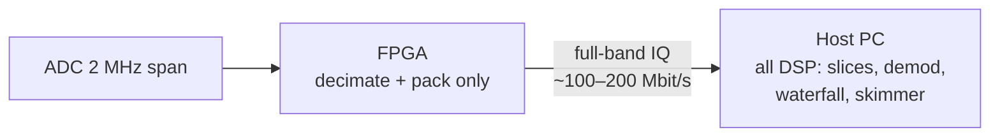
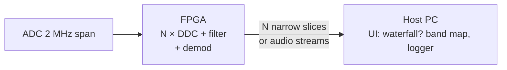
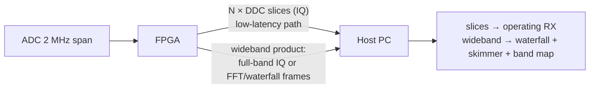
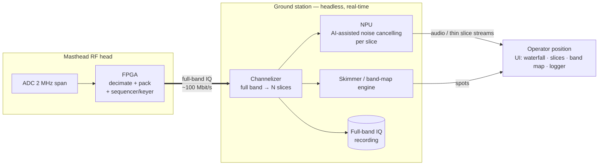

# 04 — RX DSP partitioning: what streams down the Ethernet

## Decided part

The RX chain **digitizes the entire 2 m allocation at once** (2 MHz span,
144–146 MHz, R1 assumed). No tuning at the digitizer level — the full band
exists as samples inside the FPGA at all times. This is what makes the
full-band waterfall and N independent receivers structural properties of
the radio instead of features.

## Open part

What crosses the network to the operator PC:

### Option 1 — Stream the whole band, DSP on the host

- Bandwidth is a non-issue on GbE: 2 MHz span × 2 × 16 bit ≈ **64 Mbit/s**
  raw (≈ 96 Mbit/s at 24-bit). The full band fits in under 10 % of the link.
  **The fork is therefore about latency and robustness, not throughput.**
- Maximum flexibility: new demodulators, skimmers, recording (full-band
  contest recording = replay/audit for free) are host software changes.
- Latency is host-OS-dependent (buffering, GC, scheduler); fine for SSB
  search-and-pounce, marginal for comfortable CW sidetone/QSK, and the
  radio is useless if the host hiccups mid-QSO.

### Option 2 — DSP on the FPGA, stream N VFOs

- Deterministic, low latency — demod happens meters from the antenna;
  network carries audio/thin IQ. CW sidetone and fast T/R stop depending on
  host scheduling.
- Radio is self-sufficient: a dumb client (or a failure-degraded host)
  can still operate one slice.
- Rigid: every new mode/decoder is FPGA work; the full-band waterfall
  still needs *some* wideband product streamed anyway (see below).

### Option 3 — Hybrid (the shape most mature SDR protocols converge on)

- Hardware DDC slices for *operating* (latency-critical), plus a wideband
  stream for *awareness* (waterfall, skimmer, recording — latency-tolerant).
- This is essentially the openHPSDR/Hermes model, which matters for
  decision #8: choosing such a platform gets Option 3's gateware for free
  instead of writing DDC chains from scratch.
- Open sub-question: wideband path as raw IQ (host does FFT, enables
  recording/replay) vs FPGA-side FFT frames (cheaper on the host, loses
  raw recording).

## Considerations to settle it

1. **Latency budget** — the real requirement behind Option 2. Needs a
   number: is comfortable CW QSK/sidetone (< ~10–20 ms round trip) a hard
   requirement, or is TX sidetone generated locally at the head anyway
   (in which case RX-path latency tolerances relax a lot)?
2. **Failure philosophy** — must the radio be operable with a degraded/
   generic client, or is the full custom host stack always present?
3. **Gateware budget** — custom FPGA work is the most expensive
   engineering in the project; leaning on an existing platform's DDC
   gateware (Option 3 via openHPSDR-class hardware) buys most of Option 2's
   benefit for near-zero cost.
4. **Full-band recording** — if contest replay/audit is wanted (it's
   cheap and very useful for post-contest analysis and skimmer tuning),
   raw wideband IQ must reach the host or head storage regardless.

## Direction under consideration: three-tier with a ground station

A refinement of Option 3 that moves the latency-critical DSP off the
operator PC **without** paying the custom-gateware cost of Option 2: insert
a dedicated **ground station** — a headless compute box at the base of the
mast — between the RF head and the operator position.

Division of labor:

- **Masthead FPGA does the minimum**: digitize, decimate, pack, plus the
  hard-real-time safety jobs (sequencer, local keyer). No DDC chains, no
  demod — gateware stays near-stock for whatever platform is chosen (#8).
- **Ground station does all signal processing** on general-purpose compute:
  polyphase channelization of the 2 MHz band (trivial for a modern CPU),
  demodulation, skimming, full-band recording, and **NPU-accelerated noise
  reduction per slice**. It runs headless with a real-time-tuned stack —
  deterministic latency without host-PC hiccups, meters from the head, on
  mains power (no PoE constraint on compute).
- **Operator position becomes a thin client** — UI, logger, audio. Can be
  anything, can crash without taking the radio down, satisfies the failure
  philosophy question (#2 above) by construction.

On the AI noise cancelling itself, notes for when this materializes:

- **Audio-domain NR** (RNNoise / DeepFilterNet class, per demodulated
  slice) is proven tech, runs in single-digit ms on small NPUs, and helps
  most on SSB voice — which is most of VHF contest QSOs. Low risk.
- **IQ/spectrum-domain denoising** (before demod, or waterfall
  enhancement for weak-trace spotting) is more novel and more interesting —
  potentially also steerable against *local* noise (the station's own PSU
  spurs are stationary and learnable). Higher risk, own research track.
- Contest angle worth flagging: the same NPU can score **skimming**
  (CW decode, maybe SSB callsign spotting via lightweight ASR) — arguably
  worth more points than NR polish. The full-band recording (see #4 above)
  doubles as training data collection from day one.

## Status

Digitize-whole-band: **decided** (decisions.md #15). Partitioning: **open**
(decisions.md #16) — current direction is the **three-tier ground-station
hybrid** above; NPU hardware choice and NR domain (audio vs IQ) are open
sub-questions (#17).
