# 05 — Ground station

Consolidates the ground-station requirements accumulated in
[04-dsp-partitioning.md](04-dsp-partitioning.md) into a component-level
view. The GS is the **station core**: everything except RF and the thin
clients lives here.

## Accumulated requirements

| Domain | Requirement | Source |
| --- | --- | --- |
| DSP | Channelize full 2 MHz band → N slices; demod; skimmer; full-band IQ recording | 04 |
| ML | NPU for AI noise cancelling (audio-domain first); candidate later: skimming assist | 04 |
| Audio | Professional grade: balanced mic in + phantom, studio codec, headphone amp per operator, per-ear routing matrix | 04 |
| HID | Physical operator I/O terminates here: tuning knob(s), PTT, CW paddle | 04 |
| Network | Built-in Ethernet switch: 1 × dedicated point-to-point port to mast head, N × terminal ports | 04 |
| Timing | Real-time-tuned stack; PTT/paddle handled with deterministic latency | 04 |
| Acoustics | Sits on the operating desk next to an open mic → fanless or near-silent | 03 |
| Placement | Within arm's reach of operator (knobs, mic) | 04 / Q3f |

## Form factor: 19″ rack server case, modified front panel *(considering)*

The idea: a standard rack server chassis, front panel replaced/machined
into the actual operator panel.

```mermaid
flowchart TB
    subgraph CASE[19″ rack chassis]
        subgraph FRONT[Modified front panel]
            KNOB[Tuning knob&#40;s&#41;]
            MICIN[XLR mic in]
            HP[Headphone jacks × N]
            PTTJ[PTT / paddle jacks]
            DISP[Status display?]
        end
        subgraph INSIDE[Internals]
            COMPUTE[Compute board<br/>SBC or mini-ITX x86]
            NPUM[NPU module<br/>M.2 / SoC-integrated]
            AUDIO[Audio board<br/>preamp · codec · HP amps]
            SWB[Ethernet switch board]
            PSU[Silent PSU<br/>linear or fanless]
        end
        subgraph REAR[Rear panel]
            MASTP[Mast port<br/>point-to-point &#40;or SFP&#41;]
            TERMP[Terminal ports × N]
            PWRIN[Mains in]
        end
    end
    KNOB & PTTJ --> COMPUTE
    MICIN --> AUDIO --> COMPUTE
    COMPUTE --> NPUM
    COMPUTE --> SWB
    SWB --> MASTP & TERMP
```

**Why it fits:**

- **Panel real estate is the scarce resource** for knobs, XLR, headphone
  jacks, PTT connectors — a 19″ front panel is exactly that, and a custom
  aluminum panel is a cheap, well-understood fabrication job (or even
  hand-drilled to start).
- **Same surplus arbitrage again**: used rack chassis are near-free, built
  like tanks, shielded by construction, with proper card mounting, PSU
  bays, and cable management.
- **Room to grow.** Compute board + NPU + audio board + switch + PSU with
  space left over; internal layout can separate the analog audio corner
  from switching supplies and digital boards (grounding/shielding
  discipline inside one box is decision-critical for the "pro audio"
  claim).
- **It looks like what it is** — a piece of station infrastructure, not a
  pile of SBCs. Standard rails if it ever moves into a rack; feet if it
  stays on the desk.
- **It buys into a whole ecosystem, not just a box.** 19″ is the shared
  standard of pro audio, telecom, and lab gear — so the station can grow
  as rack units in a **music-style desk rack**: the GS itself, a **linear
  PSU as its own rack unit** (the pro-audio answer to switching-supply
  noise in both the mic chain and the RF environment — and surplus rack
  linears are plentiful), and later whatever the station needs — patch
  panel, UPS/supercap unit, a spare-blocks drawer. Music racks specifically
  are made to live next to microphones: short depth, desk height, quiet by
  convention. Each function becomes a swappable rack unit — the same
  modularity philosophy as the SMA bricks, one level up.

**Obligations it brings:**

- **Server chassis assume screaming forced airflow; this build forbids
  it.** Component budget must fit passive/near-silent cooling: efficient
  compute (see NPU question), fanless PSU (or oversized ultra-quiet fan at
  low RPM), vented top over the warm zone. 2U is tight for passive; **3U–4U
  gives fin height and panel height** (a proper tuning knob wants a taller
  panel anyway).
- Depth: server cases are deep (600 mm+) for a desk — a short-depth
  (~350–450 mm) chassis or audio-gear-style case may fit the desk better
  while keeping the 19″ panel.
- Front-panel HID and audio wiring crosses the box — keep mic lines
  balanced and short, route away from the switch and PSU.

## Open questions (queued in QUESTIONS.md)

- Compute + NPU platform (Q3d) — decides everything downstream of the
  motherboard tray.
- HID transport: USB devices vs GPIO encoders (Q3g).
- Chassis height/depth and desk vs under-desk rack placement.
