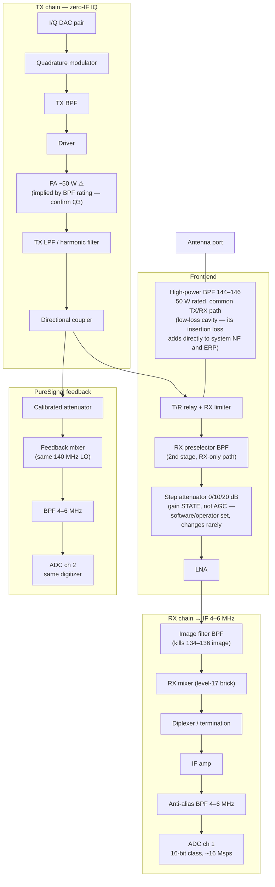
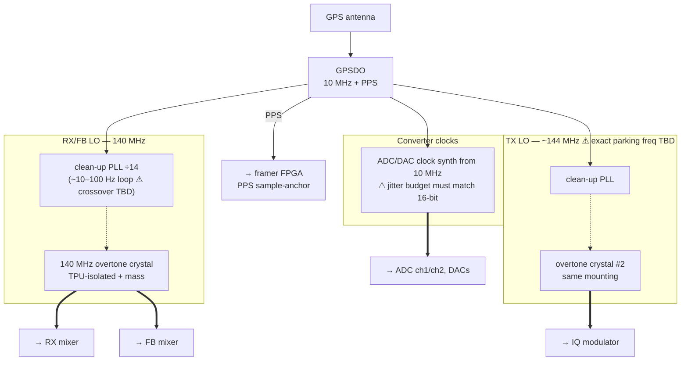
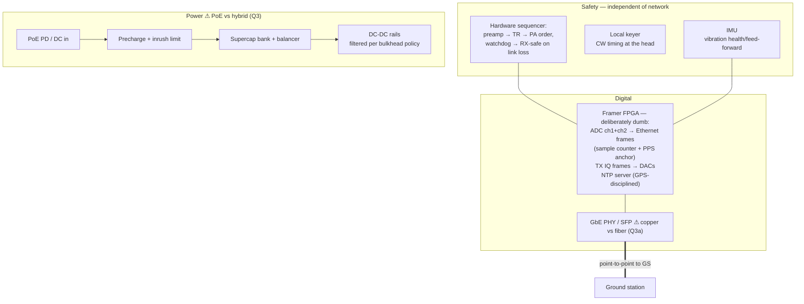

# 06 — RF head block diagram (v0)

First integration of decisions #6–#22 into one picture of the masthead
unit. Gain/level numbers are deliberately absent — the **level plan**
(cumulative gain / NF / IP3 per stage) is the next artifact and will be
built over this topology. Blocks marked ⚠ are open items.

## Signal path

## LO / reference block

## Digital / control / power

## Block inventory (surplus shopping classes)

| Block | Candidate class | Note |
| --- | --- | --- |
| High-power BPF | 50 W-rated low-loss cavity, common path | first block after the antenna; passes TX, protects RX, cleans both directions |
| T/R relay | **low-loss coax relay**, ≥ 50 W | sequenced, not RF-sensed; its loss also counts twice (NF + ERP) |
| Preselector | telecom/PMR cavity or helical, retuned to 144–146 | sets out-of-band survival |
| Step attenuator | relay/PIN switched pads | overload insurance; engaged NF penalty is acceptable exactly when the band is loud |
| LNA | PGA-103/PSA4-class or Mini-Circuits brick | NF set here for the whole station |
| Image/IF/AA filters | SBP/SLP bricks + custom LC where needed | image reject + octave-clean IF |
| RX/FB mixers | ZFM/ZX05 level-17 | measured before trust |
| IQ modulator | eval-board or brick modulator | LO leak/image handled by #21 loop |
| PA | ⚠ surplus pallet, ~50 W class (confirm Q3) | run hot, DPD-linearized |
| Coupler | directional coupler, known coupling factor | calibration path for DPD |
| GPSDO | Thunderbolt-class surplus | station time+frequency root |
| Crystals ×2 | custom overtone order | the one genuinely custom part |
| ADC/DAC + FPGA | ⚠ platform choice (#8) | now "digitizer + framer", not full SDR |

## Gain policy: no AGC in hardware

The RX chain runs **fixed gain** — no signal-driven gain control anywhere
ahead of the ADC. The 16-bit budget (see 02) exists precisely so the
strongest expected in-band signal fits under ADC full scale while the
noise floor stays comfortably above the quantization floor; gain is a
*level-plan constant*, not a control loop. What replaces AGC, in three
tiers:

1. **Fixed gain, planned** — the level plan places the antenna-referred
   clip point above the strongest survivable neighbor.
2. **Gain state, not gain control** — the step attenuator: switched by
   software or operator for gross regime changes (kW neighbor 500 m away
   vs quiet band), changing maybe twice a contest. Deliberately *not*
   signal-driven — no pumping, no IMD-vs-desense breathing, and every
   recorded sample remains absolutely calibrated as long as the state is
   logged in the stream metadata (it must be).
3. **All fast level management is DSP at the GS** — per-slice digital AGC
   for operator audio comfort, where it can be per-receiver, mode-aware,
   and instantly re-tunable. The waterfall and the recording always see
   the raw, un-AGC'd band.

## Open items blocking the level plan

1. TX power target (Q3) → PA, T/R, coupler, attenuator, supply sizing.
2. Platform (#8) → actual ADC part → full-scale input level the whole RX
   chain must be planned toward.
3. TX LO parking frequency (in-band leak management, #22).
4. Clean-up loop crossover measurement (bench, once crystals exist).
